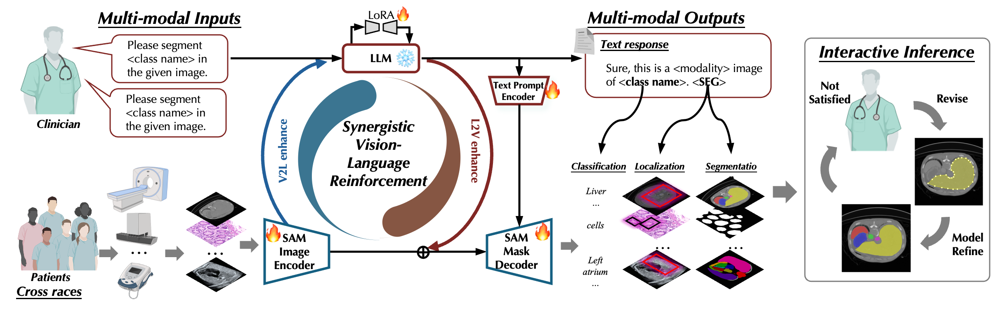
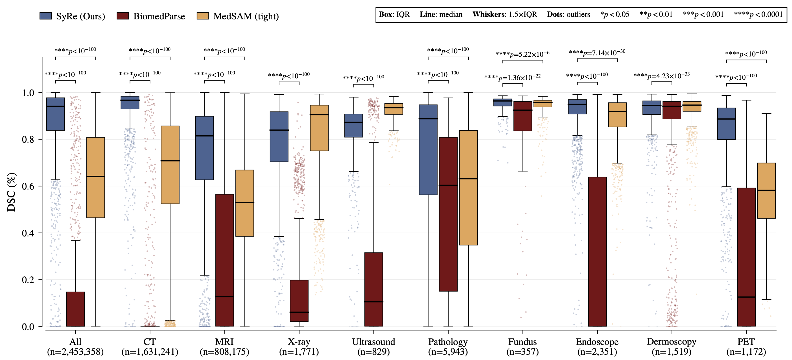
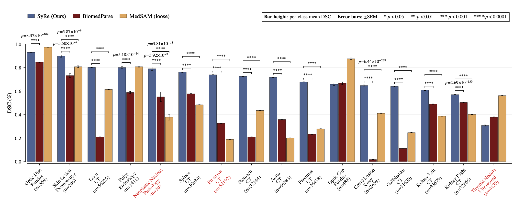
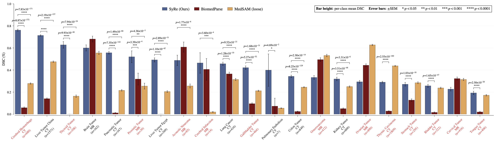
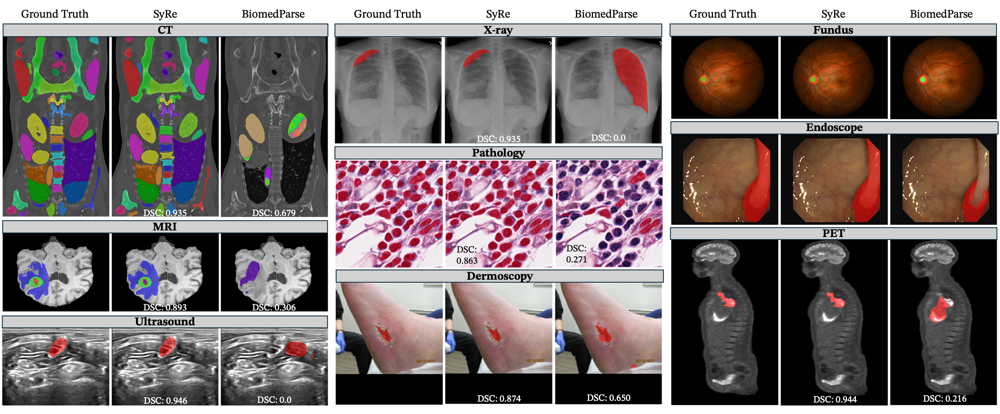
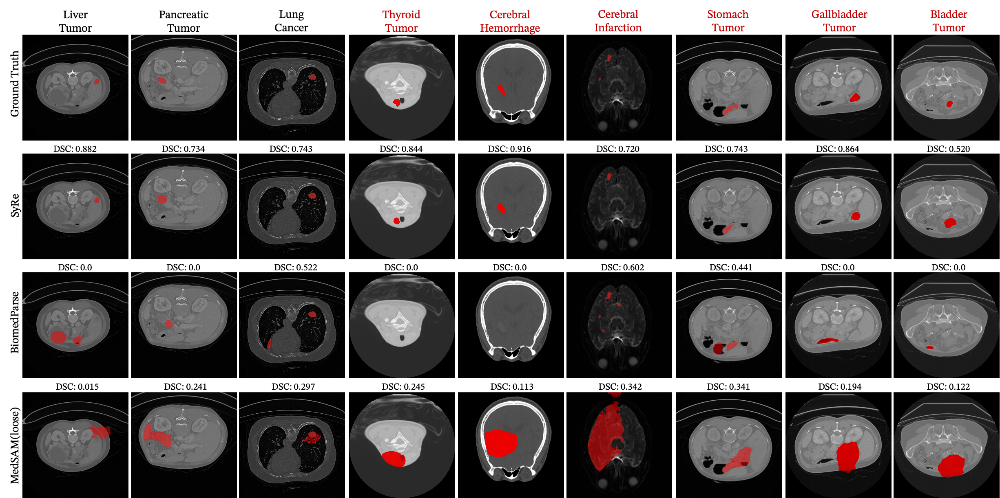
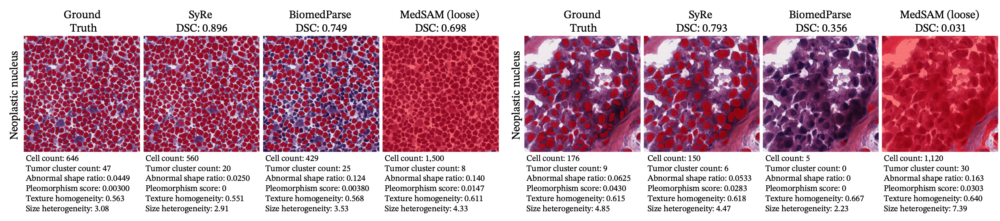

<div align="center">

# SyRe

### Synergistic Vision-Language Reinforcement Enables Scalable On-Demand Analysis across Diverse Clinical Tasks

<p>
  <a href="https://arxiv.org/abs/2505.03380"></a>
  <a href="https://huggingface.co/McGregorW/SyRe"></a>
  <a href="https://huggingface.co/datasets/McGregorW/Datasets2D"></a>
  <a href="http://143.89.46.197:7860/"></a>
</p>


</div>

SyRe is a text-driven segmentation foundation model for biomedical images. Given an image and a natural-language target such as **“liver tumor”** or **“optic disc”**, SyRe predicts a pixel-level mask without training a separate model for every class.

> **Research release.** The model is intended for research and development. It is not a medical device and should not be used as a standalone clinical decision maker.

## 📌 Overview

SyRe connects language understanding with SAM-style dense prediction through a closed-loop vision-language architecture:


<p align="center">
  
</p>
<p align="center"><em>SyRe couples vision-language reasoning with SAM-based dense prediction for on-demand biomedical segmentation.</em></p>


The accompanying study describes SyReData as a large image-mask-text collection spanning nine imaging modalities and 229 segmentation tasks. See the paper and interactive demo for the complete experimental protocol and reported results.


## 📣 Latest updates

- **Public checkpoint:** the released SyRe weights are available on [Hugging Face](https://huggingface.co/McGregorW/SyRe).
- **Public data:** the 2D image/mask collection is available on [Datasets2D](https://huggingface.co/datasets/McGregorW/Datasets2D).
- **Reproducible utilities:** this repository now includes native `2d_test` inference and batch evaluation scripts.
- **Interactive demo:** try SyRe at [143.89.46.197:7860](http://143.89.46.197:7860/).

> The public model repository is about **16.3 GB** and the public dataset repository is about **379 GB**. Download only the files or subsets you need.

## 📊 Results and visual examples

### Quantitative results


<p align="center">
  
</p>
<p align="center"><em>Quantitative comparison on internal datasets.</em></p>


<p align="center">
  
</p>
<p align="center"><em>Quantitative comparison on external datasets.</em></p>


<p align="center">
  
</p>
<p align="center"><em>Quantitative comparison on in-house datasets.</em></p>

### Qualitative results

<p align="center">
  
</p>
<p align="center"><em>Representative predictions across CT, MRI, ultrasound, pathology, dermoscopy, X-ray, fundus, endoscopy, and PET images.</em></p>

<p align="center">
  
</p>
<p align="center"><em>Representative qualitative results on in-house segmentation tasks.</em></p>

<p align="center">
  
</p>
<p align="center"><em>Example pathology application showing SyRe predictions across biomedical image patches.</em></p>


## 🛠️ Installation & setup

We recommend Python 3.10. Install a PyTorch build matching your CUDA version first, then install the repository dependencies:

```bash
conda create -n syre python=3.10 -y
conda activate syre

# Choose the PyTorch/CUDA wheel for your machine.
python -m pip install torch torchvision
python -m pip install -r requirements.txt
python -m pip install huggingface_hub
```

The command-line help can be used without downloading the model. Full inference is GPU-oriented and memory intensive.

## 📦 Prepare the public resources

### Model weights

Use the Hub ID directly, or cache the checkpoint locally:

```bash
python - <<'PY'
from huggingface_hub import snapshot_download

snapshot_download(
    repo_id="McGregorW/SyRe",
    local_dir="checkpoints/SyRe",
)
PY
```

Both of the following forms are accepted by the inference script:

```text
--model McGregorW/SyRe
--model checkpoints/SyRe
```

### Dataset

The dataset contains `train` and `test` splits. Downloading the complete repository is optional; use `allow_patterns` when you only need selected files:

```bash
python - <<'PY'
from huggingface_hub import snapshot_download

snapshot_download(
    repo_id="McGregorW/Datasets2D",
    repo_type="dataset",
    local_dir="data/Datasets2D",
    # Example: allow_patterns=["*test*", "**/*.png"]
)
PY
```

The native evaluation path follows GLaMMedv16 and reads `image2label_2d_test.json` directly. The public dataset directory should therefore contain that index together with its referenced images and masks.

## 🚀 Quick start

### Single-sample prediction on `2d_test`

```bash
python examples/inference.py \
  --model McGregorW/SyRe \
  --dataset-dir data/Datasets2D \
  --index 0 \
  --output-dir outputs/sample_000000 \
  --device cuda:0 \
  --dtype bf16 \
  --save-visualization
```

The command uses the same dataset, prompt construction, image preprocessing, and `[SEG]` batch format as the GLaMMedv16 2D test evaluator. It writes one binary mask per annotated class and `inference.json`.

For use from Python, see [`examples/inference_api.py`](examples/inference_api.py). The core calls are:

```python
import torch
from scripts.syre_2d_test import load_model, load_2d_test_dataset
from scripts.syre_2d_test import make_2d_test_loader, predict_batch

bundle = load_model("McGregorW/SyRe", device="cuda:0", dtype="bf16")
dataset = load_2d_test_dataset(bundle.tokenizer, "data/Datasets2D", mode="2d_test")
loader = make_2d_test_loader(bundle, torch.utils.data.Subset(dataset, [0]))
output, batch = predict_batch(bundle, next(iter(loader)))
```

### Evaluation on `2d_test`

```bash
python scripts/evaluate_syre.py \
  --model McGregorW/SyRe \
  --dataset-dir data/Datasets2D \
  --output-dir outputs/test \
  --device cuda:0 \
  --dtype bf16 \
  --limit 100 \
  --save-predictions \
  --save-visualizations
```

The evaluator writes:

```text
outputs/test/
├── metrics--2d_test.jsonl            # per-image/per-class metrics
├── summary--2d_test.json             # global_iou, class_iou, Dice, and grouped metrics
├── class_iou_avg--2d_test.json       # mean Dice by class, matching GLaMM naming
├── mod_iou_avg--2d_test.json         # mean Dice by modality and class
├── pred_masks/                       # optional binary predictions
└── visualizations/                   # optional green-GT/red-pred overlays
```

Use `--start-index` and `--limit` to evaluate a contiguous subset of `2d_test`. The script intentionally exposes only `2d_test`; 3D and other GLaMM evaluation modes are not included.

## 🧪 Training & validation

The original training entry point is `train.py`. The supplied launcher contains the authors' multi-node paths and NCCL settings; edit those values before using it on another machine.

```bash
python train.py --help
bash scripts/finetune_2d_syre.sh
```

Important arguments:

| Argument | Description |
| --- | --- |
| `--version` | Base or merged language-model checkpoint. |
| `--vision_pretrained` | SAM ViT-H checkpoint. |
| `--dataset_dir` | Dataset root containing indexes and referenced files. |
| `--mode`, `--mode_val` | Training and validation index suffixes. |
| `--text_prompts_path` | Optional CRD description file for training. |
| `--lora_r`, `--lora_alpha` | LoRA configuration. |
| `--mask_validation` | Enable segmentation metrics during validation. |
| `--resume` | DeepSpeed checkpoint directory. |

Merge a DeepSpeed-exported checkpoint into a Hugging Face directory with:

```bash
python scripts/merge_lora_weights.py \
  --version /path/to/base_model \
  --vision_pretrained /path/to/sam_vit_h_4b8939.pth \
  --weight /path/to/zero_to_fp32.bin \
  --save_path /path/to/merged_syre
```

## 🗂️ Repository structure

```text
model/                  SyRe, LLaVA-style modules, and SAM components
dataset/                2D medical segmentation loader and collation
scripts/inference_syre.py
                        Native 2d_test single-sample inference
scripts/evaluate_syre.py
                        Native 2d_test evaluator
scripts/syre_2d_test.py
                        Shared GLaMM-style dataset/model/metric utilities
examples/               CLI and Python API examples for `2d_test`
train.py                Training and validation entry point
```

## 📚 Citation

If you use SyRe, please cite the SyRe paper:

```latex
@misc{wang2026synergisticvisionlanguagereinforcementenables,
      title={Synergistic Vision-Language Reinforcement Enables Scalable On-Demand Analysis across Diverse Clinical Tasks}, 
      author={Haonan Wang and Jiaji Mao and Lehan Wang and Qixiang Zhang and Marawan Elbatel and Yi Qin and Huijun Hu and Baoxun Li and Wenhui Deng and Weifeng Qin and Hongrui Li and Jialin Liang and Jun Shen and Xiaomeng Li},
      year={2026},
      eprint={2505.03380},
      archivePrefix={arXiv},
      primaryClass={cs.CV},
      url={https://arxiv.org/abs/2505.03380}, 
}
```

Please also follow the attribution and usage terms of the source datasets and pretrained components used in your experiments.
